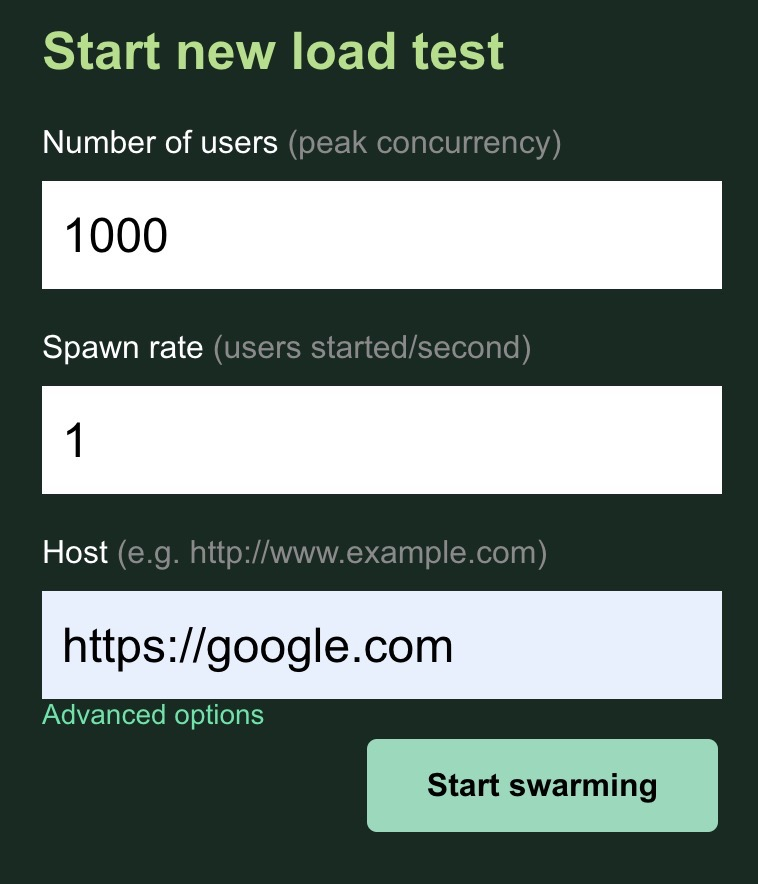

# Deploy Locust to Linode Multiple Regions using Terraform

### What is Locust?
[Locust](https://locust.io/) is a scalable, modern load / performance testing tool, written in Python. It can be deployed as single instance or across multiple nodes, following the leader-worker pattern. 

When it's deployed, a Flask-based web app starts automatically for users to manage tests, view statstics and download reports.

Locust by default looks for a test file named `locustfile.py`. The following is an example of that.

```python
import time
from locust import HttpUser, task, between

class Quickstart(HttpUser):
    wait_time = between(1, 5)

    @task
    def google(self):
        self.client.request_name = "google"
        self.client.get("https://google.com/")
```

### What is Linode?
[Linode](https://linode.com) is one of the best, affordable, and flexible cloud provider, powered by Akamai Connected Cloud. It currently has 20+ core data centers across the globe. The Terraform script in this repository will deploy a Locust leader instance and however many worker instances per different regions (i.e. data centers). Thus, when test runs, requests would be generated from multiple regions simultaneously. 

### Getting Started
Once `terraform` is installed on your local machine, you can pull the repository.

```
$ git clone git@github.com:yosepkim/terraform-linode-locust.git
```

In order to interact with Linode API, an API access token needs to be acquired. Follow the [article](https://www.linode.com/docs/products/tools/api/guides/manage-api-tokens/) to do so.

A Terraform variable file needs to be created in the root directoy of the repository. First, go to the directory:

```
$ cd terraform-linode-locust
```

Then, create and save a file named `terraform.tfvars` in the root directory with the following content after replacing `YOUR_ACCESS_TOKEN` and `YOUR_UNCRACKABLE_PASSWORD` with your values:

```
token = "YOUR_ACCESS_TOKEN"
root_password = "YOUR_UNCRACKABLE_PASSWORD"
```

Make sure the script is ready to by running `terraform plan` command. Once everything checks out, then run `terraform apply`.

Once Terraform finishes its job, IP address of the leader and the worker instances will be printed out:

```
Apply complete! Resources: 8 added, 0 changed, 0 destroyed.

Outputs:

leader_public_ip = "172.233.161.95"
workers_public_ip = [
  "172.233.130.128",
]
```

Copy the leader's IP address, then paste into the address bar of your favorite browser of choice. Populate fields with desired values and start the test by clicking on `Start swarming`:



### Multiple Region Deployment

To deploy worker instances across multiple regions of Linode, define `node_regions` variable in your `terraform.tfvars`. The following example deploys a worker instance to LA, Osaka, Paris, Milan, Chicago, and Washing DC regions.

```
token = "YOUR_ACCESS_TOKEN"
root_password = "YOUR_UNCRACKABLE_PASSWORD"
node_regions = ["us-lax", "jp-osa", "fr-par", "it-mil", "us-ord", "us-iad"]
```

### Testing against Endpoint Requiring mutual TLS

The Terraform script supports testinga against target endpoints that require mutual TLS. To enable it, first set `uses_mtls` variable to `true` in the variable file, as shown below.

```
token = "YOUR_ACCESS_TOKEN"
root_password = "YOUR_UNCRACKABLE_PASSWORD"
node_regions = ["us-lax", "jp-osa", "fr-par", "it-mil", "us-ord", "us-iad"]
uses_mtls = true
```

Second, create a directory named `certs` under the `plan` directory, then add the server certificate (CA bundle), client certificate and client key files. Check the variable definition file `variables.tf` for default names of the files, which can be overriden by using appropriate variables.

Lastly, use `mtls_locustfile.py` as a base to build your test file. Basically, you need to tweak values of `url`, `headers`, and `payload` varible (if `POST` is being tested). 

```
url = ""

payload = json.dumps({})

headers = {
  'Pragma': 'akamai-x-ew-debug, akamai-x-cache-on, akamai-x-cache-remote-on, akamai-x-check-cacheable, akamai-x-get-cache-key, akamai-x-get-true-cache-key, akamai-x-serial-no, akamai-x-get-request-id, akamai-x-get-client-ip, akamai-x-im-trace, X-Akamai-Scan-status, x-akamai-edgescape',
  'User-Agent': 'Mozilla/5.0 (Windows NT 6.1; Win64; x64) AppleWebKit/537.36 (KHTML, like Gecko) Chrome/113.0.0.0 Safari/537.36',
  'Content-Type': 'application/json'
}
```

When Terraform applies the changes, it would copy the certs and key files into each instance and replace server certificate, client certificate, and the key placeholders with the actual file names using `sed`.

